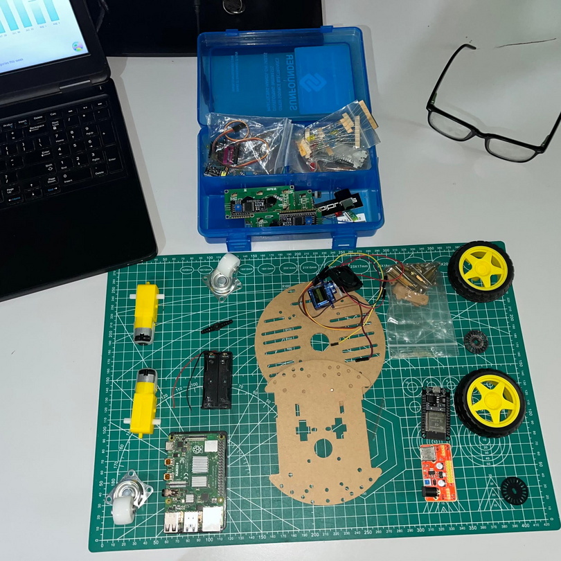
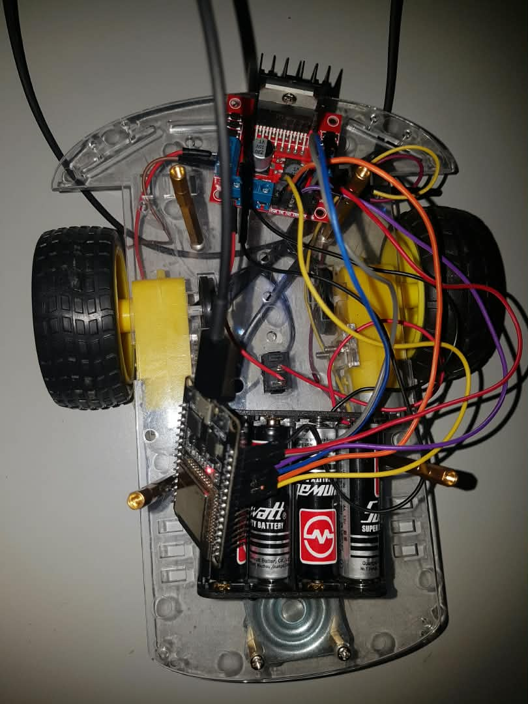

# robocar

### A remote controlled robot car made with esp32 + raspberry pi. (WIP)
<p align="center">
  
  
</p>

To install dependencies:

```bash
bun install
```

Start the development server with HMR:

```bash
bun run dev
```

Open [http://localhost:3000](http://localhost:3000). The JSON API is available
at `GET /api/hello`.

For production mode:

```bash
bun run start
```

This project was created using `bun init` in bun v1.3.14. [Bun](https://bun.com) is a fast all-in-one JavaScript runtime.
